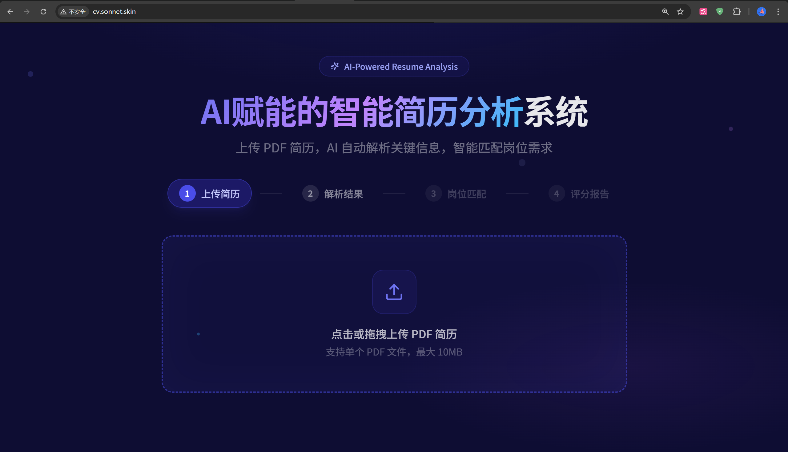

# AI 赋能的智能简历分析系统

上传 PDF 简历，AI 自动提取关键信息，并根据岗位描述进行多维度匹配评分。

## 在线预览

**http://cv.sonnet.skin**



## 功能概览

- PDF 上传与解析：支持多页 PDF，全程内存处理，文件不落盘
- 结构化信息提取：调用大语言模型提取姓名、联系方式、教育背景、技能、项目经历等字段
- 岗位匹配评分：输入岗位描述，AI 从技能匹配、经验相关性、学历匹配三个维度评分，并额外识别匹配/缺失关键词，生成评语
- 历史记录：解析结果存储于浏览器 localStorage，关闭页面后仍可查看，不依赖服务端持久化
- API Key 管理：通过前端页面（`/key`）动态更新后端 API Key，无需重启服务

## 本地运行

### 环境要求

- Python 3.12+
- Node.js 18+

### 后端

**方式一：uv（推荐）**

[uv](https://github.com/astral-sh/uv) 是 Rust 编写的 Python 包管理工具，速度远快于 pip，安装方式：`pip install uv` 或参考官方文档。

```bash
cd backend

# 创建虚拟环境并安装依赖
uv venv
uv pip install -r requirements.txt

# 启动（uv run 会自动使用 .venv，无需手动激活虚拟环境）
uv run uvicorn app.main:app --reload --port 9000
```

**方式二：标准 pip**

```bash
cd backend

# 创建并激活虚拟环境
python -m venv .venv

# Windows
.venv\Scripts\activate
# macOS / Linux
source .venv/bin/activate

# 安装依赖
pip install -r requirements.txt

# 启动
uvicorn app.main:app --reload --port 9000
```

启动后 API 文档可访问：http://localhost:9000/docs

**API Key 配置**：`backend/app/core/config.py` 中有内置的测试 Key（默认指向 DeepSeek），可直接启动使用。正式部署请替换为自己的 Key，支持两种方式：
- 在 `backend/.env` 中写入 `AI_API_KEY=sk-xxx`（优先级高于代码默认值），或
- 启动后访问前端 `/key` 页面，通过 UI 动态更新，无需重启服务

### 前端

```bash
cd frontend
npm install
npm run dev
```

前端默认运行在 http://localhost:5173，开发模式下 `/api` 请求会自动代理到后端 9000 端口。

## 项目结构

```
.
├── backend/
│   ├── Dockerfile
│   ├── requirements.txt
│   └── app/
│       ├── api/
│       │   ├── resume.py        # 简历上传与匹配路由
│       │   └── key.py           # API Key 管理路由
│       ├── core/
│       │   └── config.py        # Pydantic Settings 配置
│       ├── models/
│       │   └── schemas.py       # 请求/响应数据模型
│       └── services/
│           ├── pdf_parser.py    # PDF 解析与文本清洗
│           ├── ai_extractor.py  # 简历信息结构化提取
│           └── matcher.py       # 岗位匹配评分
└── frontend/
    └── src/
        ├── api.js               # 后端请求封装
        ├── App.jsx              # 根组件，页面路由与状态管理
        └── components/
            ├── UploadSection.jsx    # 简历上传与历史记录
            ├── ResumeResult.jsx     # 解析结果展示
            ├── MatchSection.jsx     # 岗位描述输入
            ├── MatchResult.jsx      # 匹配评分报告
            ├── KeyModal.jsx         # API Key 引导弹框
            └── KeyPage.jsx          # API Key 管理页面
```

## API 接口

| 方法 | 路径 | 说明 |
|------|------|------|
| POST | `/api/resume/upload` | 上传 PDF 简历，返回结构化解析结果 |
| POST | `/api/resume/match` | 提交岗位描述，返回多维度匹配评分 |
| GET | `/api/key` | 获取当前 Key（已打码） |
| POST | `/api/key` | 更新 API Key，立即生效 |

### 上传简历

```
POST /api/resume/upload
Content-Type: multipart/form-data

file: <PDF 文件>
```

返回结构包含 `resume_id`、`resume_data`（含姓名、联系方式、技能、项目经历等字段）。

### 岗位匹配

```
POST /api/resume/match
Content-Type: application/json

{
  "resume_id": "resume_xxxxxxxx",
  "job_description": "招聘要求文本...",
  "resume_data": { ... }   // 可选，前端传入避免服务端重启后查询失败
}
```

返回 `overall_score`、`skill_match`、`experience_match`、`education_match`，以及 AI 评语、匹配关键词和缺失关键词。

## 技术栈

**后端**

- FastAPI：异步 HTTP 框架，原生支持 OpenAPI 文档
- pdfplumber：PDF 文本解析，对多列/表格排版兼容性较好
- OpenAI SDK（兼容模式）：指向 DeepSeek API，替换 `AI_BASE_URL` 和 `AI_API_KEY` 即可切换至其他兼容模型
- Pydantic v2：数据建模与校验

**前端**

- React 19 + Vite：开发构建工具链
- Tailwind CSS：原子化样式，按需生成，最终 CSS 约 21 KB
- lucide-react：按需引入的 SVG 图标库

**部署**

- 后端：Docker 容器，Nginx 反向代理 `/api` 路径至 9000 端口
- 前端：Nginx 直接 serve `frontend/dist` 静态文件
- Serverless：根目录 `s.yaml` 支持阿里云 FC 部署

## License

MIT

